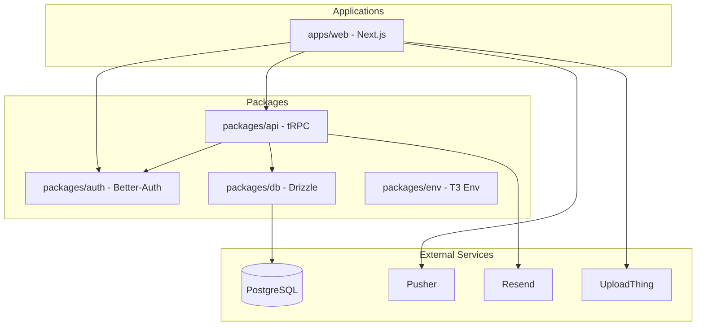

# Help Desk

> Modern customer support, built for teams.

[](https://nodejs.org)
[](https://pnpm.io)
[](https://www.typescriptlang.org)

A full-stack help desk platform for ticket management, contacts, email support, automations, and team collaboration. Built with the [Better-T-Stack](https://github.com/AmanVarshney01/create-better-t-stack)—Next.js, tRPC, Drizzle, and Better-Auth.

---

## Features

### Core

- **Ticket management** — Status, priority, and multi-channel support (email, web, API)
- **Contact & company management** — Centralized contact database with company associations
- **Multi-channel support** — Unified inbox for email, web, and API-originated conversations

### Productivity

- **Canned responses** — Reusable reply templates for faster responses
- **Saved filters** — Custom ticket filter presets for quick access
- **Tags** — Label tickets and contacts for organization and search
- **Ticket automations** — Auto-assign, route, and trigger actions based on rules

### Collaboration

- **Multi-tenant organizations** — Role-based access (admin, owner, member, viewer)
- **Real-time presence & notifications** — Live updates via Pusher
- **Rich text editor** — TipTap-powered replies with formatting and attachments

### Platform

- **Inbound email processing** — Resend webhooks for email-to-ticket conversion
- **File uploads** — UploadThing integration for attachments
- **Dashboard** — Analytics and overview of support metrics

---

## Tech Stack

| Layer        | Technologies                                                                         |
| ------------ | ------------------------------------------------------------------------------------ |
| **Frontend** | Next.js 15 (App Router), React 19, Tailwind CSS 4, shadcn/ui, TanStack Query, Motion |
| **Backend**  | tRPC 11, Drizzle ORM, PostgreSQL (pgvector)                                          |
| **Auth**     | Better-Auth (email/password, Google, GitHub, 2FA)                                    |
| **Infra**    | Turborepo monorepo, Husky, ESLint, Prettier                                          |

---

## Architecture



---

## Project Structure

```
help-desk/
├── apps/
│   └── web/           # Next.js web application
├── packages/
│   ├── api/           # tRPC routers & business logic
│   ├── auth/          # Better-Auth configuration
│   ├── db/            # Drizzle schema & migrations
│   └── env/           # Environment validation (T3 Env)
└── tooling/           # ESLint, Prettier, TypeScript configs
```

---

## Prerequisites

- **Node.js** >= 22.13.1
- **pnpm** >= 10.5.2
- **Docker** (for local PostgreSQL)
- Accounts: [Resend](https://resend.com), [UploadThing](https://uploadthing.com), [Pusher](https://pusher.com), [Google OAuth](https://console.cloud.google.com), [GitHub OAuth](https://github.com/settings/developers)

---

## Getting Started

### 1. Clone and install

```bash
git clone <repository-url>
cd help-desk
pnpm install
```

### 2. Environment setup

Copy the required variables to `apps/web/.env`. See [Environment Variables](#environment-variables) below.

### 3. Database

Start a local PostgreSQL container:

```bash
./start-database.sh
```

Apply the schema:

```bash
pnpm db:push
```

### 4. Run the app

```bash
pnpm dev
```

Open [http://localhost:3000](http://localhost:3000) in your browser.

---

## Environment Variables

| Variable                     | Required | Description                            |
| ---------------------------- | -------- | -------------------------------------- |
| `DATABASE_URL`               | Yes      | PostgreSQL connection string           |
| `BETTER_AUTH_SECRET`         | Yes      | Auth secret (min 32 chars)             |
| `BETTER_AUTH_URL`            | Yes      | App URL (e.g. `http://localhost:3000`) |
| `CORS_ORIGIN`                | Yes      | Allowed CORS origin                    |
| `GOOGLE_CLIENT_ID`           | Yes      | Google OAuth client ID                 |
| `GOOGLE_CLIENT_SECRET`       | Yes      | Google OAuth client secret             |
| `GITHUB_CLIENT_ID`           | Yes      | GitHub OAuth client ID                 |
| `GITHUB_CLIENT_SECRET`       | Yes      | GitHub OAuth client secret             |
| `GITHUB_WEBHOOK_SECRET`      | Yes      | GitHub webhook secret                  |
| `GITHUB_APP_URL`             | Yes      | GitHub App URL                         |
| `RESEND_API_KEY`             | Yes      | Resend API key                         |
| `SENDER_EMAIL`               | Yes      | Verified sender email                  |
| `PUSHER_APP_ID`              | Yes      | Pusher app ID                          |
| `PUSHER_SECRET`              | Yes      | Pusher secret                          |
| `NEXT_PUBLIC_PUSHER_KEY`     | Yes      | Pusher public key                      |
| `NEXT_PUBLIC_PUSHER_CLUSTER` | Yes      | Pusher cluster                         |
| `CRON_SECRET`                | No       | Secret for cron endpoints              |
| `UPLOADTHING_TOKEN`          | No       | UploadThing token (for file uploads)   |

---

## Available Scripts

| Command            | Description                        |
| ------------------ | ---------------------------------- |
| `pnpm dev`         | Start all apps in development mode |
| `pnpm build`       | Build for production               |
| `pnpm db:push`     | Push schema changes to database    |
| `pnpm db:studio`   | Open Drizzle Studio                |
| `pnpm db:generate` | Generate Drizzle migrations        |
| `pnpm db:migrate`  | Run migrations                     |
| `pnpm lint`        | Run ESLint                         |
| `pnpm lint:fix`    | Fix ESLint issues                  |
| `pnpm format`      | Check formatting                   |
| `pnpm format:fix`  | Format with Prettier               |
| `pnpm check-types` | TypeScript type check              |
| `pnpm test`        | Run tests                          |
| `pnpm prepare`     | Initialize Husky git hooks         |

---

## Contributing

1. Fork the repository and create a feature branch
2. Ensure code passes `pnpm lint`, `pnpm format`, and `pnpm check-types`
3. Husky runs Prettier on staged files before commit
4. Open a pull request with a clear description of changes

---

## License

Proprietary. All rights reserved.
